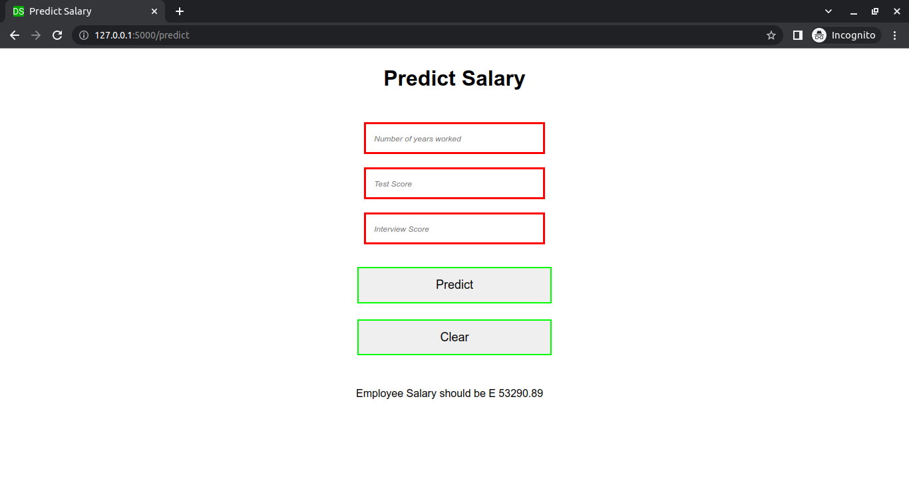
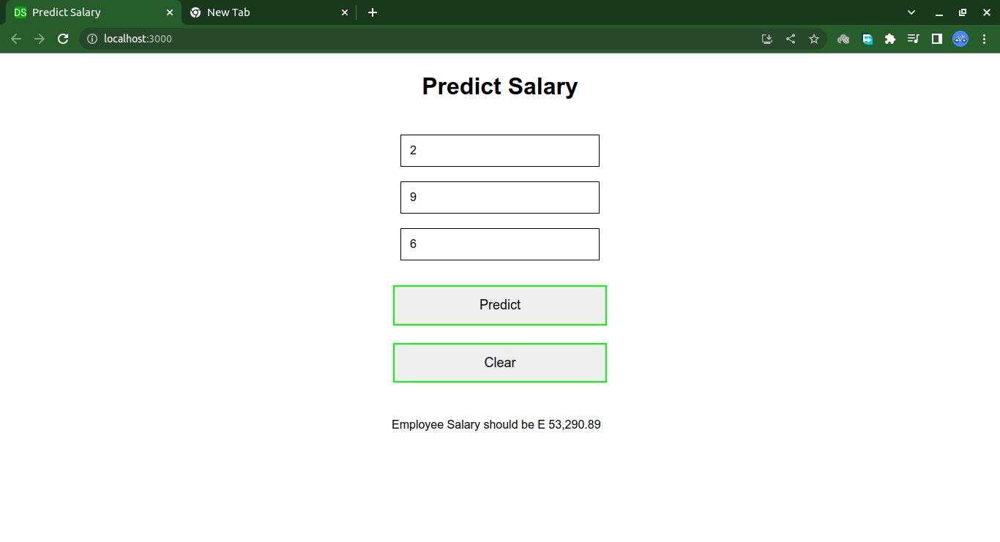
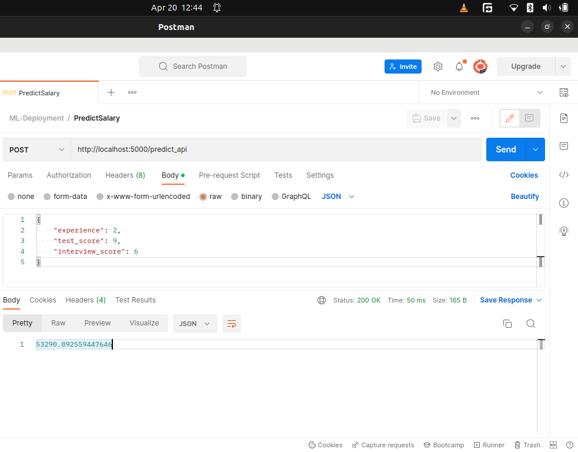

# Hiring ML Model Deployment

## Author: 
Dominic Samo, BSc Computer Science and Physics, Certified Data Scientist and Software Engineer

## Environment Used

## Running Flask Application

## Packages Used

## File Structure
├── app.py
├── Data
│   └── hiring.csv
├── model.pkl
├── model.py
├── README.md
├── requirements.txt
├── static
│   ├── css
│   │   └── style.css
│   └── favicon.ico
├── templates
│   └── index.html
└── testapi.py

## Prediction from Flask Web App

## Prediction from React Web App

## Prediction from Postman

---

### Let's Connect On LinkedIn
**LinkedIn** - https://www.linkedin.com/in/dominic-samo-754014187/

